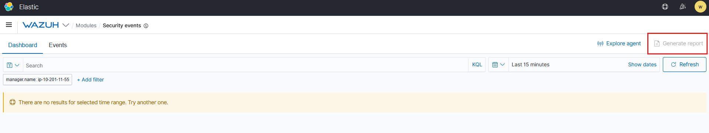

# Introduction
## What is Wazuh?
Wazuh is an open-source extensive EDR solution. It operates on a management and agent module where the device dedicated to running Wazuh is the server manager and the manager is responsible for managing agents installed on devices.


# Wazuh Agents
Agents are devices that record events and processes of a system. These agents will collect information and offload it to a designated collector for processing like Wazuh.

To deploy new agents in Wazuh, navigate to **Wazuh -> Agents -> Deploy New Agents.**


In the wizard, a command is given to copy and paste which will install the agent on the device to collect logs from.

#### How many agents does this Wazuh management server manage?
Answer: 2
#### What are the status of the agents managed by this Wazuh management server?
Answer: Disconnected

# Wazuh Vulnerability Assessment & Security Events
Wazuh's Vulnerability Assessment can be used to periodically scan an agent's OS for installed apps and their version numbers.

Once the information is collected, it is sent back to the Wazuh server and compared against a DB of CVEs to discover potential vulnerabilities.

The vulnerability scanner will run a full scan on first install and it must be configured to run in intervals afterwards (default is 5 minutes when enabled).


NOTE: There seems to be an error with this room not providing values when the date range is set. So this screenshot was from a Medium.com post that walked through this step.
#### How many "Security Event" alerts have been generated by the agent "AGENT-001"?
**Note**: You will need to make sure that your time range includes the 11th of March 2022
Answer: 196

# Wazuh Policy Auditing
Wazuh performs audits then score is compared against frameworks like MITRE, NIST, SCA.


# Monitoring Logons with Wazuh
Event logs are stored on the Wazuh management server: `/var/ossec/logs/alerts/alerts.log`.


# Collecting Windows Logs with Wazuh
A tool called *Sysmon (System Monitor)*  stores all actions and events that were captured and recorded on a Windows OS in the Windows event logs.
- Authentication attempts
- Files that were accessed
- Networking connections
- App/Service behaviors

Wazuh agents can aggregate events recorded by *Sysmon* for processing to the Wazuh manager.


This is running Sysmon to capture events from PowerShell.

Note: These images are captured from the Wazuh room in TryHackMe.

Wazuh agent file location: `C:\Program Files (x86)\ossec-agent\ossec.conf`


This configuration is added to the Wazuh agent to instruct it to send these events to the Wazuh management server.

Wazuh management server rules location: `/var/ossec/etc/rules/local_rules.xml`
<group name="sysmon,">
 <rule id="255000" level="12">
 <if_group>sysmon_event1</if_group>
 <field name="sysmon.image">\\powershell.exe||\\.ps1||\\.ps2</field>
 <description>Sysmon - Event 1: Bad exe: $(sysmon.image)</description>
 <group>sysmon_event1,powershell_execution,</group>
 </rule>
</group>
This tells the Wazuh management server to add Sysmon as a rule to visualize these events.
#### What is the name of the tool that we can use to monitor system events?
Answer: Sysmon
#### What standard application on Windows do these system events get recorded to?
Answer: Event viewer

# Collecting Linux Logs with Wazuh
Similar process to capturing Windows logs.

Wazuh management server rules file path: `/var/ossec/ruleset/rules`

#### What is the full file path to the rules located on a Wazuh management server?
Answer: /var/ossec/ruleset/rules

# Auditing Commands on Linux with Wazuh
Wazuh uses the tool *auditd* to monitor systems for certain actions and events.

To install the *auditd* package and plugin, run the command:
```cmd
sudo apt-get install auditd audispd-plugins
```

To enable it:
```cmd
sudo systemctl enable auditd.service
```

```cmd 
sudo systemctl start auditd.service
```

Auditd rules are located in: `/etc/audit/rules.d/audit.rules`

Use this command to reload the audit.rules when new rules are added:
```cmd
sudo auditctl -R /etc/audit/rules.d/audit.rules
```

Add the following to the Wazuh agent to collect the auditd log file:
```shell-session
<localfile>
    <location>/var/log/audit/audit.log</location>
    <log_format>audit</log_format>
</localfile>
```
#### What application do we use on Linux to monitor events such as command execution?
Answer: Auditd

#### What is the full path & filename for where the aforementioned application stores rules?
Answer: /etc/audit/rules.d/audit.rules

# Wazuh API
## Using Our Own Client
First, authenticate our client.

Store Wazuh management server token in Linux environment variables:
```cmd
TOKEN=$(curl -u : -k -X GET "https://WAZUH_MANAGEMENT_SERVER_IP:55000/security/user/authenticate?raw=true"
```

To confirm we authenticated properly, run:
```cmd
curl -k -X GET "https://10.201.105.213:55000/" -H "Authorization: Bearer $TOKEN"
```

Standard HTTP GET/POST/PUT/DELETE can be used:
```cmd
curl -k -X GET "https://10.201.105.213:55000/manager/status?pretty=true" -H "Authorization: Bearer $TOKEN"
```

Use Wazuh API to get management server statistics and services running:
```cmd
curl -k -X GET "https://10.201.105.213:55000/manager/configuration?pretty=true§ion=global" -H "Authorization: Bearer $TOKEN"
```

Use Wazuh API to interact with an agent:
```cmd
curl -k -X GET "https://10.201.105.213:55000/agents?pretty=true&offset=1&limit=2&select=status%2Cid%2Cmanager%2Cname%2Cnode_name%2Cversion&status=active" -H "Authorization: Bearer $TOKEN
```
## Using Wazuh API Console


#### What is the name of the standard Linux tool that we can use to make requests to  the Wazuh management server?
Answer: curl

#### What HTTP method would we use to retrieve information for a Wazuh management server API?
Answer: GET

#### What HTTP method would we use to perform an action on a Wazuh management server API?
Answer: PUT

#### Use the API console to find the Wazuh server's version.
Note: You will need to add the "**v**" prefix to the number for this answer. For example **v**1.2.3
Answer: v4.2.5

# Generating Reports with Wazuh

Note: Due to this being an old room, there were no data available to run the report.

#### Analyze the report. What is the name of the agent that has generated the most alerts?
Answer: agent-001

# Loading Sample Data
